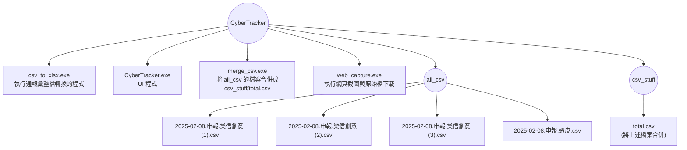
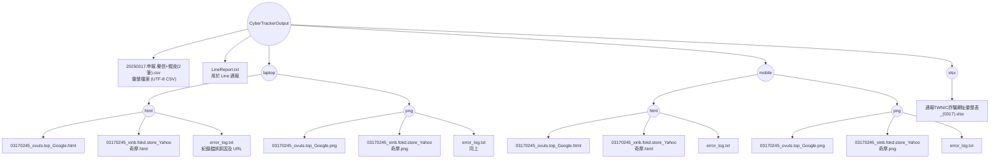

# CyberTracker 專案說明

這份 README 提供了 CyberTracker 程式的架構與執行路徑說明，並以 Mermaid 流程圖呈現檔案結構。

## 1. CyberTracker 程式本身

這裡展示的是 CyberTracker 程式的主要目錄結構，包含主要執行檔與相關資料夾。

## 2. CyberTrackerOutput 結構

以下流程圖描述 CyberTracker 執行後輸出的目錄結構，包含 CSV、Line 報告以及不同平台（laptop 與 mobile）下的 HTML 與 PNG 資料夾：

---

## 3. 其他相關資源

另外，你也可以參考下方圖片 (由 draw.io 產生) 瞭解 CyberTracker 的執行路徑：

---
